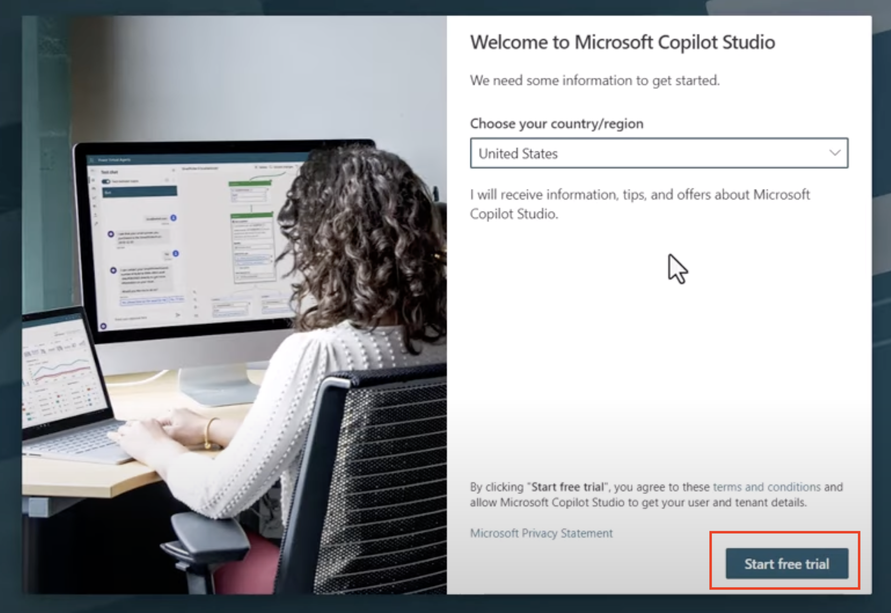

# 🚨 Mission 00: Course Setup

## 🕵️‍♂️ CODENAME: `OPERATION DEPLOYMENT READY`

## 🎯 Mission Brief

Welcome to the first mission of your training as a Copilot Studio Agent.  
Before you can start building your first AI agent, you need to establish your **field-ready development environment**.

This briefing outlines the systems, access credentials, and setup steps required to successfully operate in the Microsoft 365 ecosystem.

## 🔎 Objectives

Your mission includes:

1. Getting access to a Microsoft 365 account and Copilot Studio
1. Standing up a developer environment to build your agents in
1. Opening your environment in the maker portal and reaching Copilot Studio (all paths)
1. (For self-service paths) Enabling your environment to publish agents
1. Preparing a SharePoint site to serve as your data source in later missions

---

## 🛤️ Choose Your Path

There are three ways to get a working environment for this course. **Pick one** based on your situation, then follow only that path.

| Path | Best for | Setup effort | What you get |
|------|----------|--------------|--------------|
| **A — Request Login** | Live AgentCon events | None — fully pre-provisioned | A loaner account with environment, publishing, and SharePoint data ready to go |
| **B — Power Up Program** | Anyone wanting zero setup | None — pre-configured | A hosted, pre-configured environment with office hours and forums |
| **C — Self-Service Trials** | Self-paced learners | ~15 min | Your own brand-new Microsoft 365 tenant |

>[!TIP]
>If you already have a Microsoft 365 tenant with Power Platform and Copilot Studio access, you can skip the paths below and jump straight to [Part 2: Data Setup](./data-setup.md).

---

## 🅰️ Path A — Request Login

A pool of pre-provisioned loaner accounts is available for this course. These accounts already have a **developer environment**, **publishing enabled**, and the **Contoso IT SharePoint site** set up for you — so once you log in, you're ready to build.

>[!IMPORTANT]
>There are **only 25 logins** available, so several people may share one. That's fine — everyone can build **in parallel** on the same account, as long as each person **adds their initials** to the names they create (see [Sharing a Login](#-sharing-a-login-add-your-initials) below). The initials keep your agents, solutions, publisher prefix, and flows from colliding.
>
>Two things to know: the **publish** and **test-in-Teams** steps run under the single shared identity, so **take turns** on those (or treat them as a facilitator demo). For a fully independent, isolated experience, use **Path B (Power Up)** or **Path C (Trials)** instead.

1. Open the [Request Login Form](https://forms.microsoft.com/r/E0hU0pMcsu)
1. Provide your name and email address
1. Select **Submit**
1. Check your mailbox for instructions on how to log in

### (Optional) Create a browser profile

Keep your loaner account separate from your personal one to avoid sign-in confusion.

1. Open Microsoft Edge
1. Select **Profile** > **Sign in to sync data** (or, if you already have a profile, **Profile** > **Set up a new profile** > **Work or School**)
1. The additional profile is now available for selection

✅ **Path A is complete — your environment, publishing, and SharePoint data are already provisioned.** Next, complete the **All Paths — Open Your Environment and Copilot Studio** section below, then head straight to Mission 01 (your SharePoint data is already set up, so you can skip Part 2).

---

## 🅱️ Path B — Power Up Program

>[!TIP]
>Prefer not to deal with environment setup, trial licenses, or expiring tenants? The **Microsoft Power Up Program** offers this course on its own platform with a **pre-configured environment**, office hours, and discussion forums if you get stuck. Sign up at [aka.ms/powerup](https://aka.ms/powerup).

Because the Power Up environment is pre-configured for the course, you don't need to create an environment, enable publishing, or build the SharePoint site — those are provided for you. Confirm with your Power Up facilitator whether the **Contoso IT** site and **Devices** list are already in place; if not, follow [Part 2: Data Setup](./data-setup.md).

Even with a pre-configured environment, still complete the **All Paths — Open Your Environment and Copilot Studio** section below so you select the right environment before you start building.

---

## 🅲 Path C — Self-Service Trials

Use this path to stand up your **own** Microsoft 365 tenant. You'll create a Copilot Studio trial and a developer environment, then enable publishing.

### Step 1 — Get a Microsoft 365 account

If you don't already have a work or school Microsoft 365 account, start a trial of **Microsoft 365 Business Basic** from the [Microsoft 365 Business plans page](https://www.microsoft.com/microsoft-365/business/microsoft-365-plans-and-pricing) and select **Try for free**.

>[!NOTE]
>Use a work or school style email — personal accounts (`@outlook.com`, `@gmail.com`) can't sign up for the business and Copilot Studio trials.

### Step 2 — Start a Copilot Studio trial

1. Navigate to [aka.ms/TryCopilotStudio](https://aka.ms/TryCopilotStudio)
1. Enter the email address for the account you configured in Step 1 and select **Next**
1. It should recognize your account. Select **Sign In**
1. Select **Start Free Trial**

>[!NOTE]
>**Trial notes:**
>- The free trial provides **full Copilot Studio capabilities**.
>- You'll receive email notifications about expiration. You can extend the trial in **30-day increments, up to 90 days** of agent runtime.
>- If your tenant administrator disabled self-service sign-up, you'll see an error — contact your Microsoft 365 admin to re-enable it.

### Step 3 — Create a developer environment

Sign up for a **Power Apps Developer Plan** to get a free environment to build in.

1. Go to the [Power Apps Developer Plan website](https://aka.ms/PowerAppsDevPlan)
1. Enter your email address, tick the checkbox, and select **Start free**

The environment is named after you — for example, **Adele Vance's environment**.

>[!NOTE]
>Avoid using a **Managed Environment** for this course — managed-environment restrictions can block the flow-as-a-tool features used in later missions.

### Step 4 — Enable the ability to publish

Copilot Studio **trial** environments block publishing by default. To publish the agents you build in later missions, enable your account as a Copilot Studio author.

1. Create a security group:
   1. Go to [admin.cloud.microsoft](https://admin.cloud.microsoft)
   1. Select **Teams & groups** > **Active teams & groups** > **Security groups** > **Add a security group**
   1. Name it (for example, **AgentCreators**) and add **yourself** as a member
1. Grant the group authoring rights:
   1. Go to [admin.powerplatform.com](https://admin.powerplatform.com)
   1. Select the **Manage** tab > **Tenant settings**
   1. Open **Copilot Studio authors**, select the **pencil** icon, add your security group, and select **Save**

>[!IMPORTANT]
>Publishing an agent is **not required to complete the missions or earn your badge** — but enabling it now means the publish steps will work later if you want to try them. If you're on a trial and skip this, expect publishing to be blocked.

➡️ Next, complete the **All Paths — Open Your Environment and Copilot Studio** section below, then continue to [Part 2: Data Setup](./data-setup.md) to create the SharePoint site your agents will use.

---

## 🌐 All Paths — Open Your Environment and Copilot Studio

No matter how you got your environment (Path A, B, or C), open it once in the Power Apps maker portal and confirm you can reach Copilot Studio before you start building. On the self-service path (Path C), this first visit also finishes provisioning your environment.

### Step 1 — Open your environment in the maker portal

1. Go to [make.powerapps.com](https://make.powerapps.com)
1. Sign in with your course account
1. In the top-right **environment picker**, select your developer environment (on Path C it's named after you — for example, **Adele Vance's environment**)
1. Wait for the portal to finish loading with your environment selected. On a brand-new self-service environment, first-time provisioning can take a few minutes.

>[!NOTE]
>If you don't see your environment in the picker, wait a minute and refresh — a newly created developer environment can take a short while to appear.

### Step 2 — Open Copilot Studio

1. Go to [copilotstudio.microsoft.com](https://copilotstudio.microsoft.com)
1. Confirm the **environment picker** (top-right) shows the **same** environment you selected above — the agents you build are scoped to the selected environment
1. You're now ready to build agents.

>[!IMPORTANT]
>Always check the environment picker in both portals before building. Creating an agent in the wrong environment is the most common setup mistake — your work won't appear where you expect it.

---

## 🤝 Sharing a Login? (Add Your Initials)

Using **Path A (Request Login)** and sharing one account with other participants? Because you all build in the **same environment as the same user**, anything you create at the environment level can collide. To keep everyone's work separate, **append your initials to the end of every top-level object you create** throughout the missions:

| Object | Example | Why |
|--------|---------|-----|
| Agent name | `Contoso Tech Support Pro - ABC` | Avoids a list full of identical agents |
| Solution display name | `Contoso Helpdesk Agent - ABC` | Solution names must be unique in the environment |
| Solution **Name** (schema) | `ContosoHelpdeskAgentABC` | The schema name must be unique |
| Publisher **prefix** | `ctsabc` | **Required** — the prefix must be unique; lowercase letters/numbers only, no spaces |
| Agent flow name | `Device Request Flow - ABC` | Flows live at the environment level |

> [!NOTE]
> **Working in parallel:** each person builds their **own** agent on the shared account. Topics and variables live *inside* your own agent, so they won't collide with anyone else's — only the environment-level names in the table above need your initials.
>
> **Publishing & Teams testing:** the **publish** and **test-in-Microsoft-365-Copilot/Teams** steps run under the single shared identity, so **take turns** on those (or have the facilitator demo them). For a fully independent experience, use **Path B (Power Up)** or **Path C (Trials)** so each person gets an isolated tenant.

---

## ✅ Mission Complete

You've successfully:

- Chosen an onboarding path and signed in to Microsoft 365
- Opened your environment in the maker portal ([make.powerapps.com](https://make.powerapps.com)) and selected it
- Confirmed access to Microsoft Copilot Studio with the same environment selected
- (Path C) Created a developer environment and enabled publishing

Up next: depending on your path, finish [Part 2: Data Setup](./data-setup.md), then build your [first declarative agent for M365 Copilot](../01-create-a-declarative-agent-for-M365Copilot/README.md).

<!-- markdownlint-disable-next-line MD033 -->

