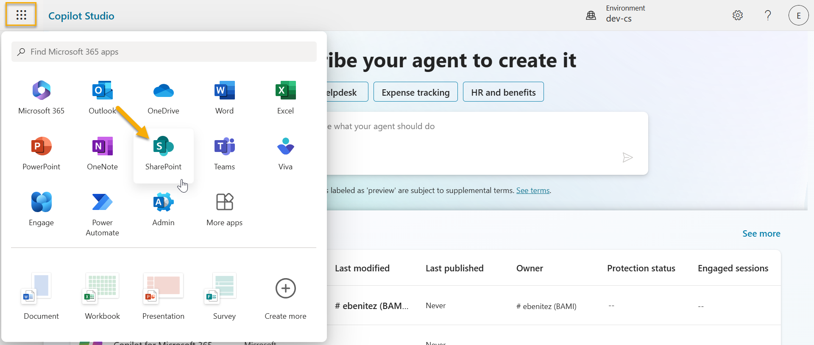
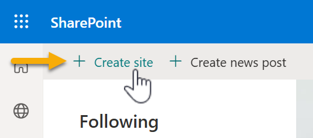
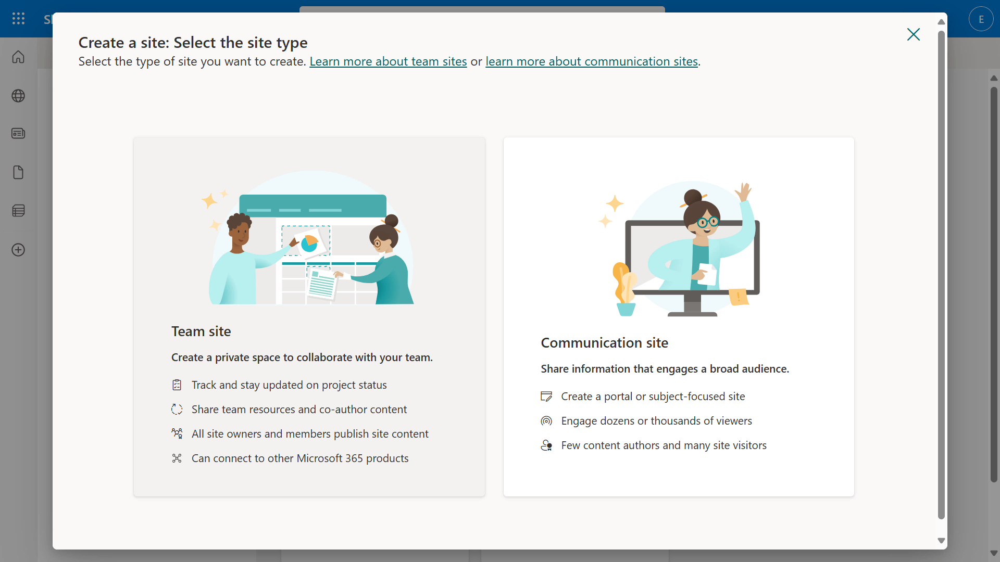
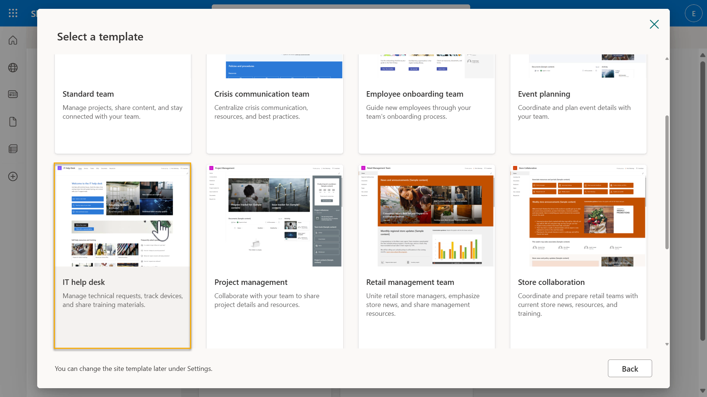
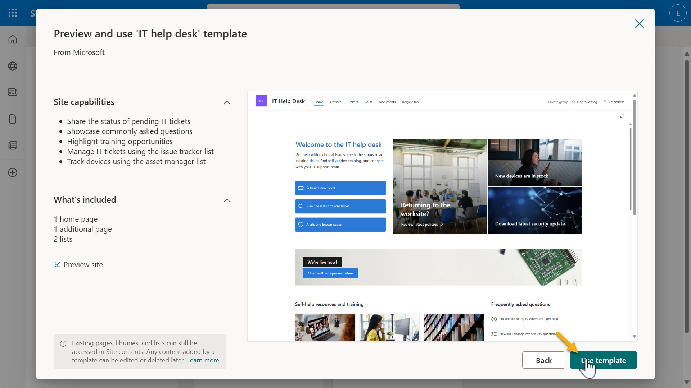
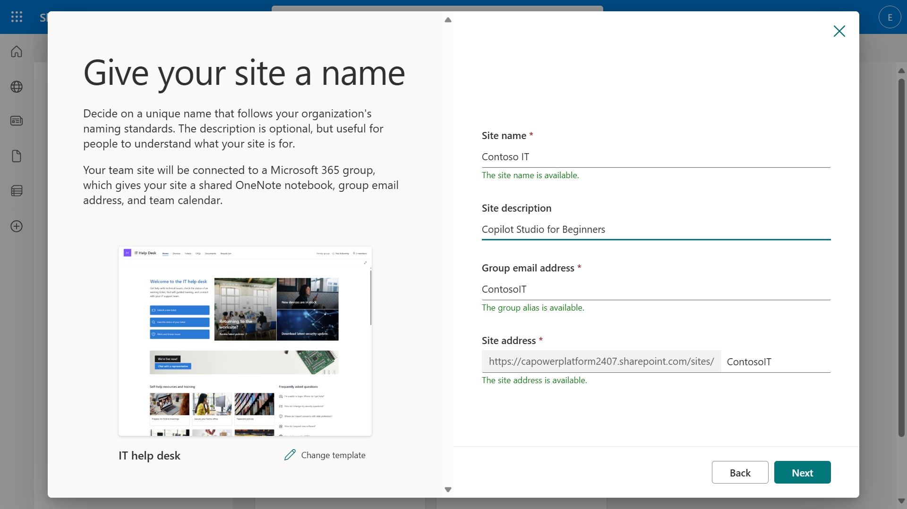
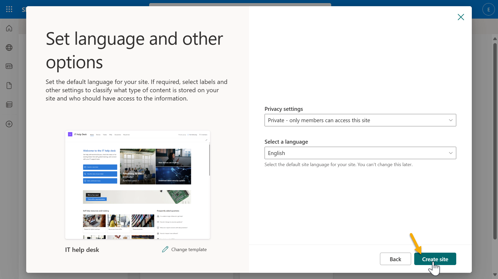
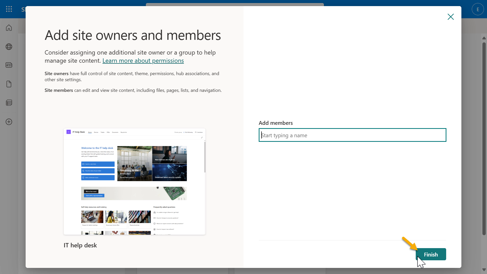

# 🚨 Mission 00 — Part 2: Data Setup

## 🕵️‍♂️ CODENAME: `OPERATION GROUND TRUTH`

## 🎯 Mission Brief

Several later missions ground your agent in real data — a SharePoint **Devices** list standing in for Contoso's IT asset inventory. In this part you'll create the **Contoso IT** SharePoint site and populate the **Devices** list with sample hardware.

>[!IMPORTANT]
>**Who needs this part?**
>- **Path A (Request Login):** ⏭️ **Skip this.** Your SharePoint site and Devices data are already provisioned.
>- **Path B (Power Up):** ⏭️ Likely **skip** — confirm with your facilitator. If the **Contoso IT** site and **Devices** list aren't already there, complete the steps below.
>- **Path C (Trials):** ✅ **Do this part** to create the data your agents will use in Missions 04 and 07.

---

## Step 1 — Create the Contoso IT SharePoint site

1. Select the **waffle** icon at the top-left of Microsoft Copilot Studio to open the app menu, then select **SharePoint**.

   

1. SharePoint loads. Select **+ Create site**.

   

1. In the dialog, select **Team site**.

   

1. A list of Microsoft templates loads. Scroll down and select the **IT help desk** template.

   

1. Select **Use template** to create the site from the IT help desk template.

   

1. Enter the site details and select **Next**:
   - **Site name:** `Contoso IT`
   - **Site description:** `Copilot Studio for Beginners`
   - **Site address:** `ContosoIT`

   

1. Set the **Language** to **English** and leave the other options at their defaults, then continue.

   

1. Add members if you wish, then select **Finish**. Copy the site URL — you'll reference it in later missions.

   

---

## Step 2 — Add an Image column to the Devices list

The IT help desk template includes a **Devices** list. Add a column to hold a device photo.

1. Open the **Devices** list on your new site.
1. Add a new column of type **Hyperlink** named **Image**.

---

## Step 3 — Create sample data

Populate the **Devices** list with at least four sample devices so your agents have something to retrieve. You can add items manually using the table below, or import the ready-made [`devices-sample-data.csv`](./assets/devices-sample-data.csv) from this module's `assets` folder.

| Title | Status | Manufacturer | Model | Asset Type | Color | Serial Number | Purchase Date | Purchase Price | Order # | Image |
|-------|--------|--------------|-------|------------|-------|---------------|---------------|----------------|---------|-------|
| Surface Laptop 13 | Available | Microsoft | Surface Laptop 7 13-inch | Laptop | Platinum | SL13-2024-001 | 2024-06-15 | 1299.99 | ORD-2024-1001 | [Surface-Laptop-13.png](./images/device-images/Surface-Laptop-13.png) |
| Surface Laptop 15 | Available | Microsoft | Surface Laptop 7 15-inch | Laptop | Platinum | SL15-2024-001 | 2024-07-01 | 1599.99 | ORD-2024-1002 | [Surface-Laptop-15.png](./images/device-images/Surface-Laptop-15.png) |
| Surface Pro | Available | Microsoft | Surface Pro 11 | Tablet | Platinum | SP11-2024-001 | 2024-05-20 | 1199.99 | ORD-2024-1003 | [Surface-Pro-12.png](./images/device-images/Surface-Pro-12.png) |
| Surface Studio | Available | Microsoft | Surface Studio 2+ | Desktop | Platinum | SS2-2024-001 | 2024-04-01 | 4299.99 | ORD-2024-1004 | [Surface-Studio.png](./images/device-images/Surface-Studio.png) |

>[!TIP]
>The full sample dataset (12 devices with varied **Status** values — Available, Assigned, Under Repair, Retired) is in [`assets/devices-sample-data.csv`](./assets/devices-sample-data.csv). Importing the whole set gives your agent richer answers in later missions. A helper script, [`Update-DevicePhotos.ps1`](./assets/Update-DevicePhotos.ps1), is also included to populate the **Image** column.

The device photo URLs reference the images stored in this module:

- Surface Laptop 13 → `./images/device-images/Surface-Laptop-13.png`
- Surface Laptop 15 → `./images/device-images/Surface-Laptop-15.png`
- Surface Pro → `./images/device-images/Surface-Pro-12.png`
- Surface Studio → `./images/device-images/Surface-Studio.png`

---

## ✅ Part 2 Complete

You've successfully:

- Created the **Contoso IT** SharePoint site from the IT help desk template
- Added the **Image** column to the **Devices** list
- Populated the **Devices** list with sample data

Up next: build your [first declarative agent for M365 Copilot](../01-create-a-declarative-agent-for-M365Copilot/README.md).

<!-- markdownlint-disable-next-line MD033 -->

