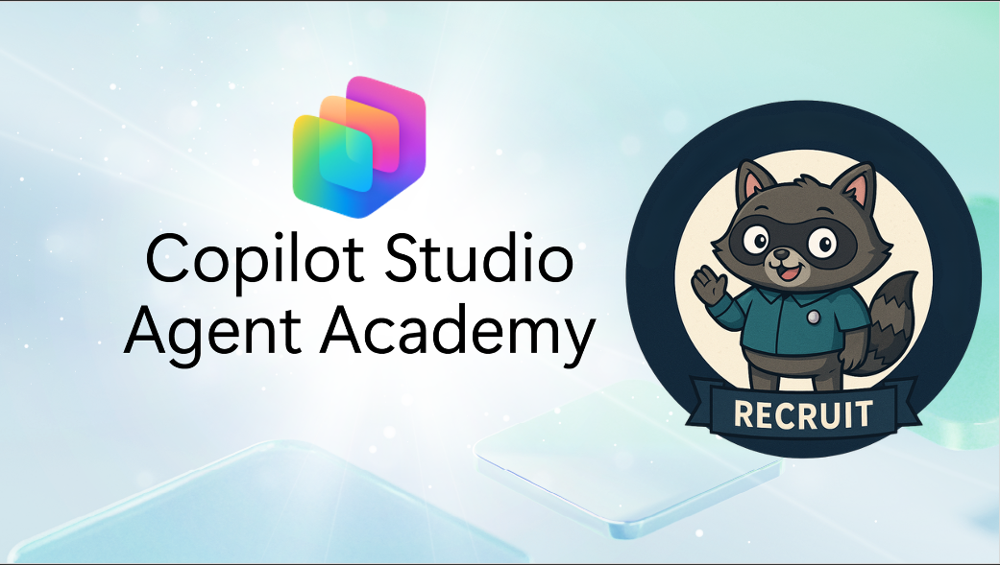

# Welcome Recruit

**Welcome, Recruit.**  
Your mission—should you choose to accept it—is to master the art of building agents using **Microsoft Copilot Studio**.

This hands-on training is your entry point into the **world of agents**: from grounded prompts to Adaptive Cards and agent flows, you'll learn how to build, scale, and deploy intelligent agents using real-world tools and use cases.

> [!NOTE]
> This workshop is adapted from Microsoft's open-source **[Agent Academy — Recruit track](https://aka.ms/agent-academy-recruit)** ([source on GitHub](https://github.com/microsoft/agent-academy/tree/main/docs/recruit)). The two opening conceptual modules — *Introduction to Agents* and *Copilot Studio Fundamentals* — are delivered as a **live presentation** during this session, so the missions below start straight at the hands-on labs.

---

## 🎯 Mission Objective

By completing the Agent Academy, you'll be able to:

- Understand what agents are in the context of Microsoft Copilot Studio
- Explore how Large Language Models (LLMs), retrieval-augmented generation (RAG), and orchestration come together in an agent
- Build both **declarative** and **custom agents**
- Enhance agents with **Topics**, **Adaptive Cards**, and **Agent Flows**
- Deploy agents to **Microsoft Teams** and **Microsoft 365 Copilot**

---

## 🧪 Prerequisites

To complete all missions, you’ll need:

- A Microsoft 365 environment with **Microsoft Copilot Studio** access — [Mission 00](./00-course-setup/README.md) walks you through three ways to get one: a **provided login**, **self-service trials**, or the **Power Up** program
- A SharePoint site with a **Devices** list — set up in [Mission 00 · Part 2: Data Setup](./00-course-setup/data-setup.md) (already provisioned on the provided-login and Power Up paths)
- Optional: Basic knowledge of SharePoint, Power Platform, or Power Fx

---

## 🧬 Who This Is For

This course is ideal for:

- Makers and developers exploring **Copilot Studio**
- IT pros building **Microsoft 365 Copilot extensions**
- Power Platform enthusiasts who want to **level up** with intelligent agents
- Anyone who prefers to learn by **doing**

---

## 🧭 Curriculum Overview

This academy is broken into progressive lessons—each one designed as a field mission to level up your agent-building skills.

| Lesson | Title | Mission Briefing |
|--------|-------|------------------|
| `00` | 🧰 [Course Setup](./00-course-setup/README.md) | Pick an onboarding path (provided login, trials, or Power Up) and get into Copilot Studio |
| `00b` | 🗂️ [Course Setup · Part 2: Data Setup](./00-course-setup/data-setup.md) | Create the Contoso IT SharePoint site and Devices list (skip if pre-provisioned) |
| `01` | 👩‍💻 [Create a Declarative Agent](./01-create-a-declarative-agent-for-M365Copilot/README.md) | Add your own agent to the Microsoft 365 Copilot, grounded in a prompt |
| `02` | 🧩 [Creating a Solution](./02-creating-a-solution/README.md) | Package your agent into a reusable solution for environment management |
| `03` | 🚀 [Get Started with Pre-Built Agents](./03-using-prebuilt-agents/README.md) | Use and customize a template agent to accelerate setup |
| `04` | ✍️ [Build a Custom Agent](./04-create-agent-from-conversation/README.md) | Create a new Copilot grounded in knowledge sources |
| `05` | 🧠 [Add a Topic with Triggers](./05-add-new-topic-with-trigger/README.md) | Use Topics to define custom question/answer paths |
| `06` | 🪪 [Enhance with Adaptive Cards](./06-add-adaptive-card/README.md) | Build an Adaptive Card using Power Fx and SharePoint |
| `07` | 🔁 [Automate with Agent Flows](./07-add-an-agent-flow/README.md) | Use Adaptive Card input to trigger back-end flows |
| `08` | 🧭 [Add Event Triggers](./08-add-event-triggers/README.md) | Enable your agent to act autonomously using event-based logic |
| `09` | 📢 [Publish Your Agent](./09-publish-your-agent/README.md) | Deploy your agent to Microsoft Teams and Microsoft 365 Copilot |

---

## 🚀 Keep Going After the Workshop

Today's session covers the hands-on **Recruit** missions above. Want to finish the full track on your own, earn your **completion badge**, or go deeper?

- 🎓 **Complete the full self-paced Recruit course** — including the *Understanding Licensing* module and the steps to claim your verifiable completion badge — at **[aka.ms/agent-academy-recruit](https://aka.ms/agent-academy-recruit)**.
- 🧗 **Advance to the next tracks.** Agent Academy continues beyond Recruit with more advanced tracks (for example, **Operative**) that build on what you've learned here. Explore them from the [Agent Academy repository](https://github.com/microsoft/agent-academy).

> [!TIP]
> Everything you build in this workshop carries straight over — pick up the official course right where these missions leave off.

---

## 🙏 Credits & Source

This workshop is a community-run adaptation of Microsoft's open-source **[Agent Academy](https://github.com/microsoft/agent-academy)** (Recruit track), used under its original license. All product instructions and lab content originate from Microsoft; the AgentCon framing and delivery are provided by **Paritta Group**. For the canonical, continuously updated material, always refer to **[aka.ms/agent-academy-recruit](https://aka.ms/agent-academy-recruit)**.

<!-- markdownlint-disable-next-line MD033 -->

